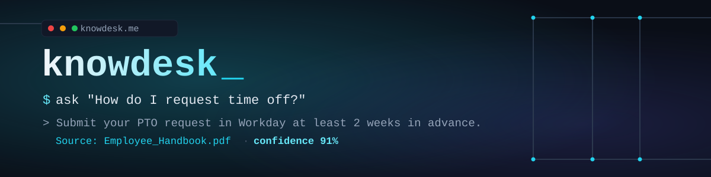
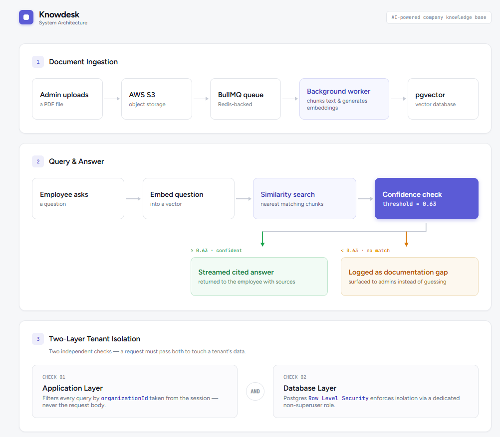
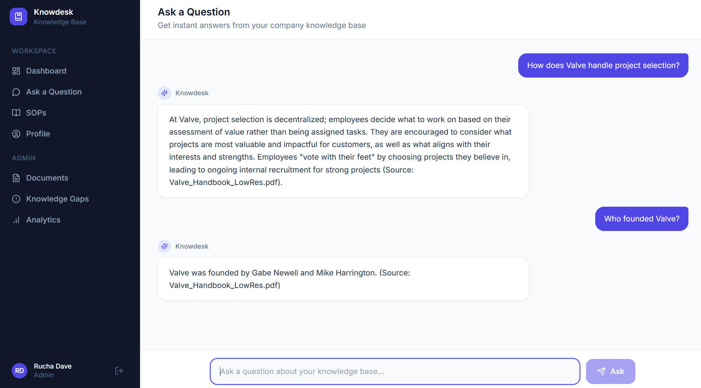
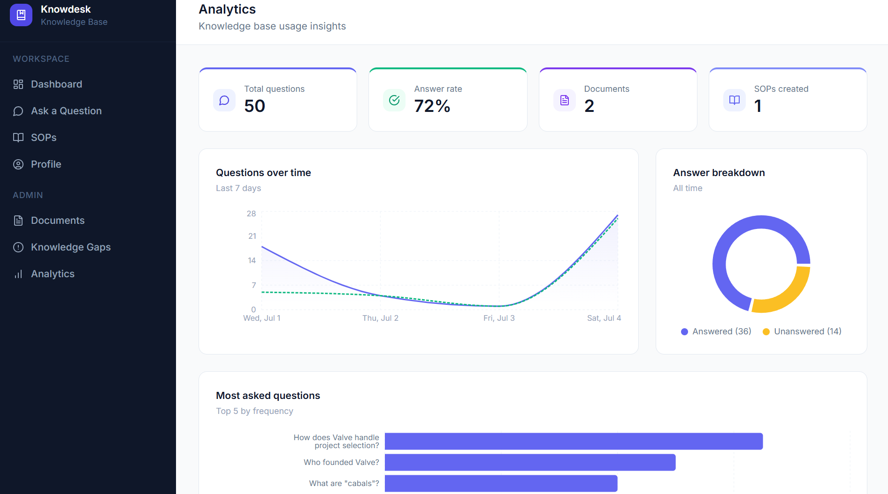

<p align="center">
  
</p>

<p align="center">
  
  
  
  
  
</p>

<p align="center">
  <strong>Ask your company's knowledge base a question in plain English. Get a cited answer in seconds, not a Slack thread three days later.</strong>
</p>

<p align="center">
  <a href="https://knowdesk.me"><strong>Live Demo</strong></a>
</p>

---

## The Problem

Employees waste real time every week hunting through scattered PDFs and old Slack threads for basic answers. How do I submit an expense report. What does the parental leave policy actually say.

The deeper problem: most internal docs tools assume a company already has **clean, complete documentation** to search through. Most do not.

**Knowdesk solves both.**

* Ask a question in plain English, get an **instant, cited answer** pulled from the company's own documents
* Nothing confident enough to answer? It gets **logged as a documentation gap**, never guessed at
* No documentation yet? An **AI SOP generator** turns a plain language description into a structured, searchable SOP immediately

---

## Demo

[Video placeholder, will add a short walkthrough here]

---

## Features

* **RAG based Q and A** with streamed, cited answers pulled from uploaded PDFs
* **AI SOP generator** that turns a plain language description into a structured SOP
* **Gap tracking** that logs unanswered questions for admin review instead of hallucinating
* **Full tenant isolation** so each company's data stays separate at both the app layer and the database layer
* **Role based access**, where Admins manage content and analytics and Employees ask questions and browse SOPs

---

## Architecture

## Ask Page




The core design decision here is **isolation at two independent layers**.

Every query is scoped by `organizationId` at the **application layer**. That same boundary gets enforced again, independently, by **PostgreSQL Row Level Security** through a dedicated database role with no superuser access.

Both layers matter. RLS alone means nothing if the connecting role can bypass it. App layer checks alone are one bug away from leaking data across tenants.

| Layer | Tech |
|---|---|
| Frontend and API | Next.js 14 (App Router), TypeScript |
| Database | PostgreSQL with pgvector, Prisma |
| Background jobs | Redis and BullMQ, standalone worker process |
| AI and RAG | OpenAI (text embedding 3 small, gpt 4o mini), LangChain.js |
| Storage | AWS S3 |
| Auth | NextAuth with Google OAuth |
| Deployment | AWS EC2, GitHub Actions CI/CD |
| Testing | Jest, Supertest |

---

## Real Bugs Found and Fixed

While writing the test suite for role based access, I checked the actual document upload route before writing a test against it.

**It had no role check at all.** Any authenticated employee, not just admins, could upload documents.

Fixed the route first. Added the missing admin only check. Then wrote a test proving both the fix and the absence of the original bug going forward.

This is the whole reason the test suite exists. Not to confirm code already works, but to actually catch things like this.

---

## Screenshots

## Ask Page



## Analytics Dashboard



---

## Getting Started

```bash
git clone https://github.com/DaveRucha/Knowdesk.git
cd Knowdesk
pnpm install

# start Postgres and Redis
docker compose up -d

# copy and fill in your own values
cp .env.example .env.local

# run migrations
pnpm prisma migrate dev

# start the app and the background worker in separate terminals
pnpm dev
pnpm worker
```

---

## Testing

```bash
pnpm test
```

**28 tests across 7 suites, all passing.**

* Pure unit tests for chunking and confidence threshold logic
* Supertest integration tests against a real, RLS protected Postgres test database
* Coverage: tenant isolation, role based authorization, invite token replay and expiry, SOP generation correctness

---

## Project Structure

```
src/
  app/
    (protected)/     dashboard, documents, sops, analytics, ask
    api/             auth, documents, sops, search, invites
  lib/               prisma client, chunking, confidence logic, auth
server/
  processors/        BullMQ worker (pdfProcessor)
tests/               Jest and Supertest suite
docs/                banner, architecture diagram, screenshots
```

---

## License

MIT

---

<p align="center">Built by <a href="https://github.com/DaveRucha">Rucha Dave</a></p>