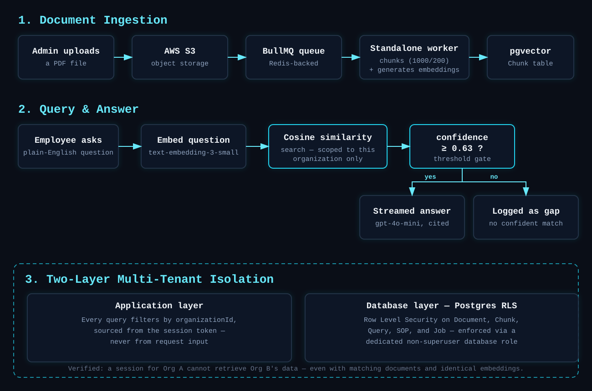

<p align="center">
  
</p>

<p align="center">
  
  
  
  
  
</p>

## The Problem

Employees waste real time every week hunting through scattered PDFs and old Slack threads just to find how to submit an expense report or what the parental leave policy actually says. The deeper problem is that most internal docs tools assume a company already has clean, complete documentation to search through. Most do not.

Knowdesk solves both. Employees ask a question in plain English and get an instant, cited answer pulled from the company's own documents. If nothing answers confidently, the question gets logged as a documentation gap instead of getting guessed at. And for companies with little documentation to begin with, an AI SOP generator turns a plain language process description into a structured, searchable SOP immediately, so the knowledge base has value from day one.

Live demo: https://knowdesk.me

## Demo

[Video placeholder, will add a short walkthrough here]

## Features

* RAG based Q and A with streamed, cited answers pulled from uploaded PDFs
* AI SOP generator that turns a plain language description into a structured SOP
* Gap tracking that logs unanswered questions for admin review instead of hallucinating
* Full tenant isolation so each company's data stays separate at both the app layer and the database layer
* Role based access, where Admins manage content and analytics and Employees ask questions and browse SOPs

## Architecture

<p align="center">
  
</p>

The core design decision here is isolation at two independent layers. Every query is scoped by organizationId at the application layer, and that same boundary is enforced again, independently, by PostgreSQL Row Level Security through a dedicated database role with no superuser access. Both layers matter. RLS alone means nothing if the connecting role can bypass it, and app layer checks alone are one bug away from leaking data across tenants.

| Layer | Tech |
|---|---|
| Frontend and API | Next.js 14 (App Router), TypeScript |
| Database | PostgreSQL with pgvector, Prisma |
| Background jobs | Redis and BullMQ, running as a standalone worker process |
| AI and RAG | OpenAI (text embedding 3 small, gpt 4o mini), LangChain.js |
| Storage | AWS S3 |
| Auth | NextAuth with Google OAuth |
| Deployment | AWS EC2, GitHub Actions CI/CD |
| Testing | Jest, Supertest |

## Real Bugs Found and Fixed

While writing the test suite for role based access, I checked the actual document upload route before writing a test against it, instead of assuming the code did what the product model claimed. It did not. Any authenticated employee, not just admins, could upload documents. There was no role check at all.

I fixed the route first, adding the missing admin only check, then wrote a test proving both the fix and the absence of the original bug going forward. This is the whole reason the test suite exists. Not to confirm code already works, but to actually catch things like this.

## Screenshots

<p align="center">
  
</p>

<p align="center">
  
</p>

## Getting Started

```bash
git clone https://github.com/DaveRucha/Knowdesk.git
cd Knowdesk
pnpm install

# start Postgres and Redis
docker compose up -d

# copy and fill in your own values
cp .env.example .env.local

# run migrations
pnpm prisma migrate dev

# start the app and the background worker in separate terminals
pnpm dev
pnpm worker
```

## Testing

```bash
pnpm test
```

28 tests across 7 suites, all passing. This includes pure unit tests for chunking and confidence threshold logic, plus Supertest integration tests that run against a real, RLS protected Postgres test database. Those tests cover tenant isolation, role based authorization, invite token replay and expiry, and SOP generation correctness.

## Project Structure

```
src/
  app/
    (protected)/     dashboard, documents, sops, analytics, ask
    api/             auth, documents, sops, search, invites
  lib/               prisma client, chunking, confidence logic, auth
server/
  processors/        BullMQ worker (pdfProcessor)
tests/               Jest and Supertest suite
docs/                banner, architecture diagram, screenshots
```

## License

MIT

---

<p align="center">Built by <a href="https://github.com/DaveRucha">Rucha Dave</a></p>